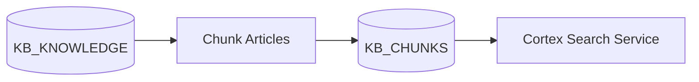

# Knowledge Builder

Knowledge Builder Service - A Snowflake-native application for building, testing, and analyzing knowledge bases with Cortex Search.

## Overview

This project provides tools for:
- **Knowledge Base Management**: Process and chunk HTML documents for search
- **Search Testing**: Baseline testing with golden pairs and ad-hoc search playground
- **Feedback Collection**: User feedback on search quality and relevance
- **Exploratory Data Analysis**: Analyze knowledge base quality, outbound links, and image sources

## Data Pipeline

This repo implements a knowledge processing pipeline that transforms KB articles into search-ready chunks for Cortex Search.

### Pipeline Stages



### Chunking

The chunking module (`src/utils/chunking.py`) uses Snowpark DataFrames to:
1. Strip HTML tags and normalize whitespace
2. Split text using `SPLIT_TEXT_RECURSIVE_CHARACTER` (default: 1800 chars, 300 overlap)
3. Write chunks to `KB_CHUNKS` table

```python
from src.utils.chunking import chunk_knowledge_articles

chunk_knowledge_articles(
    session,
    source_table="KB_KNOWLEDGE",
    target_table="KB_CHUNKS",
    chunk_size=1800,
    chunk_overlap=300,
)
```

### Cortex Search Service

The `KB_SEARCH` service is created on the chunked data:

```sql
CREATE OR REPLACE CORTEX SEARCH SERVICE KB_SEARCH
  ON CHUNK_TEXT
  WAREHOUSE = COMPUTE_WH
  TARGET_LAG = '1 hour'
AS (
  SELECT KB_SYS_ID, CHUNK_INDEX, CHUNK_TEXT, SOURCE_UPDATED_ON
  FROM KB_CHUNKS
);
```

## Features

### Streamlit Application
The main Streamlit app (`app/streamlit_app.py`) provides four key interfaces:

1. **Stats**: Metrics on search performance (queries, responses, similarity scores)
2. **Feedback**: Review and rate search results from baseline tests and ad-hoc queries
3. **Playground**: Interactive search interface with AI-powered responses
4. **EDA**: Knowledge base analysis including numeric/categorical profiling and link analysis

### Backend Services
- **Python Services** (`src/services/`): FastAPI service for knowledge processing
- **Extractors** (`src/extractors/`): Data extraction from external sources (ServiceNow)
- Snowpark-based data operations
- Integration with Cortex Search and Cortex LLM services

### ServiceNow Extractor

Extract attachments from ServiceNow knowledge bases:

```python
from src.extractors.servicenow import ServiceNowClient

client = ServiceNowClient(
    instance_url="https://instance.servicenow.com",
    username="admin",
    password="password"
)

for attachment in client.list_attachments(table_name="kb_knowledge"):
    content = client.download_attachment(attachment.sys_id)
    print(f"{attachment.file_name}: {len(content)} bytes")
```

Or set `SERVICENOW_USERNAME` and `SERVICENOW_PASSWORD` environment variables.

## Prerequisites

- Python 3.13.9
- Snowflake account with access to:
  - Cortex Search Service
  - Cortex Complete (LLM)
  - Required tables: `KB_KNOWLEDGE`, `KB_CHUNKS`, `SEARCH_QUERIES`, `SEARCH_FEEDBACK`
- Snowflake CLI (`snow`) installed

## Installation

Install dependencies using `uv`:

```bash
# Install core dependencies
uv sync

# Install with EDA capabilities (for streamlit app)
uv sync --group eda

# Install with dev tools (Jupyter, linters)
uv sync --group dev
```

## Configuration

### Environment Variables
Copy `.env.example` to `.env` and configure:

```bash
SNOWFLAKE_ACCOUNT=your_account
SNOWFLAKE_USER=your_user
SNOWFLAKE_PASSWORD=your_password
SNOWFLAKE_DATABASE=KNOWLEDGE_BUILDER
SNOWFLAKE_SCHEMA=PUBLIC
```

### Snowflake Configuration
The `snowflake.yml` file defines the Streamlit app deployment configuration:
- **Entity name**: `feedback_app`
- **Main file**: `streamlit_app.py`
- **Query warehouse**: `COMPUTE_WH`

## Usage

### Running Locally

```bash
# Run the Streamlit app locally
uv run streamlit run app/streamlit_app.py

# Run Jupyter notebooks
uv run jupyter notebook notebooks/
```

### Deploying to Snowflake

Deploy the Streamlit app to your Snowflake account:

```bash
snow streamlit deploy
```

This will:
1. Upload the app files from the `app/` directory to the configured Snowflake stage
2. Create/update the Streamlit app in Snowsight (entity: `feedback_app`)
3. Make the app accessible at: `https://<account>.snowflakecomputing.com/streamlit/KNOWLEDGE_BUILDER/PUBLIC/FEEDBACK_APP`

**Note**: Ensure your `snowflake.yml` configuration matches your target database/schema and that all required tables and Cortex services exist.

## Project Structure

```
knowledge-builder/
├── app/                       # Streamlit application
│   ├── streamlit_app.py       # Main entry point
│   ├── data_operations.py     # Snowflake data operations
│   └── ui_components.py       # UI components and page logic
├── src/
│   ├── extractors/            # Data extraction clients
│   │   └── servicenow.py      # ServiceNow Attachment API client
│   ├── services/              # Backend services (Python)
│   │   └── kb_builder_svc.py  # FastAPI service for knowledge processing
│   ├── utils/                 # Python utility functions
│   │   ├── chunking.py        # Snowpark-based KB chunking
│   │   └── html_utils.py      # HTML parsing utilities
│   └── demos/                 # Demo scripts and examples
├── database/                  # Snowflake database artifacts
│   └── migrations/            # Numbered SQL scripts (run in order)
├── notebooks/                 # Jupyter notebooks for analysis and setup (see [notebooks/README.md](notebooks/README.md))
├── docs/                      # Additional documentation
├── pyproject.toml             # Python dependencies and project metadata
├── snowflake.yml              # Snowflake deployment configuration
└── config.py                  # Application configuration
```

## Database Schema

Pipeline tables:
- `KB_KNOWLEDGE`: Source knowledge articles (HTML content in `TEXT` column)
- `KB_CHUNKS`: Chunked articles for search (`KB_SYS_ID`, `CHUNK_INDEX`, `CHUNK_TEXT`)

Application tables:
- `SEARCH_QUERIES`: Logged search queries and responses
- `SEARCH_FEEDBACK`: User feedback on search results
- `GOLDEN_PAIRS`: Baseline test query/answer pairs
- `EVALUATION_RESULTS`: Evaluation metrics and test results

Required Cortex services:
- `KB_SEARCH`: Cortex Search Service on `KB_CHUNKS.CHUNK_TEXT`

SQL migrations are in `database/migrations/`, numbered for dependency order:

| Script | Description |
|--------|-------------|
| `01_create_database_schema.sql` | Database and schema setup |
| `02_create_compute_pool.sql` | SPCS compute pool and image repo |
| `03_create_network_rules.sql` | Network rules and external access |
| `04_create_tables.sql` | KB_KNOWLEDGE, KB_CHUNKS, and app tables |
| `05_create_cortex_search.sql` | Cortex Search Service on chunks |
| `06_create_functions.sql` | FN_DECOMPOSE_CHUNK, EXTRACT_DOMAINS_FROM_HTML |
| `07_create_proc_kb_get.sql` | KB_GET procedure |
| `08_create_proc_kb_search.sql` | KB_SEARCH procedure |
| `09_create_proc_kb_explore.sql` | KB_EXPLORE procedure |
| `10_create_proc_analyze_images.sql` | ANALYZE_IMAGE_LINKS procedure |

### Schemachange Placeholders

The SQL scripts use the following placeholders for deployment:

| Placeholder | Description | Example |
|-------------|-------------|---------||
| `<% KB_DATABASE_NAME %>` | Database for KB objects | `KNOWLEDGE_BUILDER` |
| `<% KB_SCHEMA_NAME %>` | Schema for KB objects | `PUBLIC` |
| `<% KB_WAREHOUSE_NAME %>` | Warehouse for Cortex Search | `COMPUTE_WH` |
| `<% SPCS_COMPUTE_POOL_NAME %>` | SPCS compute pool | `KB_POOL` |
| `<% SPCS_IMAGE_REPO_NAME %>` | Image repository name | `KB_IMAGES` |
| `<% SPCS_STAGE_NAME %>` | Stage for specs | `KB_STAGE` |
| `<% SPCS_EAI_NAME %>` | External access integration | `KB_EAI` |
| `<% SERVICENOW_INSTANCE_HOST %>` | ServiceNow host for network rule | `instance.servicenow.com` |

## API Reference

### FN_DECOMPOSE_CHUNK
Helper function to extract summary and chunk_text from structured chunk format.

```sql
SELECT FN_DECOMPOSE_CHUNK(chunk_text)['summary']::STRING;
SELECT FN_DECOMPOSE_CHUNK(chunk_text)['chunk_text']::STRING;
```

### KB_GET
Retrieve a single knowledge base article by identifier.

```sql
CALL KB_GET({ 'kb_sys_id': 'abc123' });
CALL KB_GET({ 'kb_number': 'KB0012345' });
```

**Parameters**: `kb_sys_id` (string) OR `kb_number` (string)

**Returns**: `{ summary, text, kb_sys_id, kb_number, chunk_count }`

### KB_SEARCH
Search the knowledge base using natural language queries via Cortex Search.

```sql
CALL KB_SEARCH({ 'question': 'How do I reset my password?' });
CALL KB_SEARCH({ 'question': 'VPN issues', 'limit': 5, 'knowledge_base': 'IT Support' });
```

**Parameters**:
| Parameter | Type | Required | Description |
|-----------|------|----------|-------------|
| question | string | Yes | Natural language search query |
| limit | number | No | Max results (default: 10) |
| kb_number | string | No | Filter by article number |
| kb_sys_id | string | No | Filter by sys_id |
| knowledge_base | string | No | Filter by knowledge base name |
| exclude_articles | boolean | No | Omit full articles from response |

**Returns**: `{ query, limit, results[], articles[] }`

### KB_EXPLORE
Discover available filter values and statistics from the knowledge base.

```sql
CALL KB_EXPLORE();
```

**Returns**: `{ total_chunks, article_count, knowledge_bases[], processing_versions[] }`

## Development

### Code Quality

```bash
# Format and lint
uv run ruff check .
uv run ruff format .
```

### Testing

Run Jupyter notebooks for end-to-end testing:

```bash
uv run jupyter notebook notebooks/KNOWLEDGE_BUILDER_SETUP.ipynb
```

## Dependencies

### Core
- `snowflake-snowpark-python`: Snowflake data operations
- `fastapi`: REST API framework
- `pandas`: Data manipulation
- `pydantic`: Data validation

### Streamlit App (eda group)
- `streamlit`: Web application framework
- `altair`: Data visualization
- `ydata-profiling`: Automated EDA reports

### Development (dev group)
- `jupyter`: Interactive notebooks
- `ruff`: Linting and formatting

## License

Internal project for Snowflake AI FDE team.
