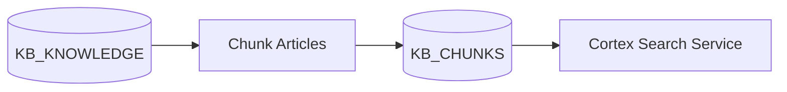

# Knowledge Builder

A Snowflake-native application for building, testing, and analyzing knowledge bases with Cortex Search.

## Overview

This project provides tools for:
- **Knowledge Base Management**: Process and chunk HTML documents for search
- **Search Testing**: Baseline testing with golden/synthetic pairs and ad-hoc search playground
- **Feedback Collection**: User feedback on search quality and relevance
- **Exploratory Data Analysis**: Analyze knowledge base quality, outbound links, and image sources

## Data Pipeline

This repo implements a knowledge processing pipeline that transforms KB articles into search-ready chunks for Cortex Search.

### Pipeline Stages



### Chunking

The chunking module (`src/utils/chunking.py`) uses Snowpark DataFrames to:
1. Strip HTML tags and normalize whitespace
2. Split text using `SPLIT_TEXT_RECURSIVE_CHARACTER` (default: 1800 chars, 300 overlap)
3. Write chunks to `KB_CHUNKS` table

```python
from src.utils.chunking import chunk_knowledge_articles

chunk_knowledge_articles(
    session,
    source_table="KB_KNOWLEDGE",
    target_table="KB_CHUNKS",
    chunk_size=1800,
    chunk_overlap=300,
)
```

### Cortex Search Service

The `KB_SEARCH` service is created on the chunked data with filter attributes:

```sql
CREATE OR REPLACE CORTEX SEARCH SERVICE KB_SEARCH
    ON CHUNK_TEXT
    ATTRIBUTES KB_SYS_ID, KB_NUMBER, CHUNK_INDEX, KNOWLEDGE_BASE, CAN_READ_USER_CRITERIA, CANNOT_READ_USER_CRITERIA, PROCESSING_VERSION
    WAREHOUSE = COMPUTE_WH
    TARGET_LAG = '1 hour'
AS (
    SELECT KB_SYS_ID, KB_NUMBER, CHUNK_INDEX, CHUNK_TEXT, SHORT_DESCRIPTION,
           KNOWLEDGE_BASE, CAN_READ_USER_CRITERIA, CANNOT_READ_USER_CRITERIA,
           PROCESSING_VERSION, SOURCE_UPDATED_ON
    FROM KB_CHUNKS
);
```

## Features

### Streamlit Application
The main Streamlit app (`app/streamlit_app.py`) provides four key interfaces:

1. **Stats**: Metrics on search performance (queries, responses, similarity scores)
2. **Feedback**: Review and rate search results from baseline tests and ad-hoc queries
3. **Playground**: Interactive search interface with AI-powered responses
4. **EDA**: Knowledge base analysis including numeric/categorical profiling and link analysis

### Backend Services
- **Python Services** (`src/services/`): FastAPI service for knowledge processing
- **Extractors** (`src/extractors/`): Data extraction from external sources (ServiceNow)
- Snowpark-based data operations
- Integration with Cortex Search and Cortex LLM services

### ServiceNow Extractor

Extract attachments from ServiceNow knowledge bases:

```python
from src.extractors.servicenow import ServiceNowClient

client = ServiceNowClient(
    instance_url="https://instance.servicenow.com",
    username="admin",
    password="password"
)

for attachment in client.list_attachments(table_name="kb_knowledge"):
    content = client.download_attachment(attachment.sys_id)
    print(f"{attachment.file_name}: {len(content)} bytes")
```

Alternatively, set `SERVICENOW_USERNAME` and `SERVICENOW_PASSWORD` environment variables.

## Prerequisites

- Python 3.13.9
- Snowflake account with access to:
  - Cortex Search Service
  - Cortex Complete (LLM)
  - Required tables: `KB_KNOWLEDGE`, `KB_CHUNKS`, `SEARCH_QUERIES`, `SEARCH_FEEDBACK`
- Snowflake CLI (`snow`) installed
- Docker (for SPCS service deployment)
- just task runner (optional, for deployment automation)

## Installation

Install dependencies using `uv`:

```bash
# Install core dependencies
uv sync

# Install with EDA capabilities (for Streamlit app)
uv sync --group eda

# Install with dev tools (Jupyter, linters)
uv sync --group dev
```

## Configuration

### Environment Variables
Copy `.env.example` to `.env` and configure:

```bash
ROLE_NAME=ACCOUNTADMIN

# Knowledge base location
KB_DATABASE_NAME=KNOWLEDGE_BUILDER
KB_SCHEMA_NAME=CORE
KB_TABLE_NAME=SAMPLE_KB_KNOWLEDGE

# SPCS configuration
SPCS_COMPUTE_POOL_NAME=SANDBOX_COMPUTE_POOL_CPU
SPCS_IMAGE_REPO_NAME=IMAGE_REPOSITORY
SPCS_STAGE_NAME=APP_STAGE
SPCS_DATABASE_NAME=KNOWLEDGE_BUILDER
SPCS_SCHEMA_NAME=CORE
SPCS_WAREHOUSE_NAME=COMPUTE_WH
SPCS_EAI_NAME=KNOWLEDGE_BUILDER_EAI

# Service details
KB_BUILDER_SVC_NAME=KB_BUILDER
KB_BUILDER_IMAGE_NAME=kb-builder-svc

# Snowflake connection name (from ~/.snowflake/connections.toml)
SNOW_CONNECTION=default
```

### Snowflake Configuration
The `snowflake.yml` file defines the Streamlit app deployment configuration:
- **Entity name**: `feedback_app`
- **Main file**: `streamlit_app.py`
- **Query warehouse**: `COMPUTE_WH`

## Usage

### Running Locally

```bash
# Run the Streamlit app locally
uv run streamlit run app/streamlit_app.py

# Run the FastAPI service locally (with auto-reload)
just kb_builder_svc

# Run Jupyter notebooks
uv run jupyter notebook notebooks/
```

### Deploying to Snowflake

#### Full Deployment (using justfile)

The `just deploy` command handles the complete deployment:

```bash
just deploy
```

This will:
1. Log into the Snowflake image registry
2. Run infrastructure SQL scripts (database, network rules, compute pool)
3. Build and push Docker images to SPCS
4. Deploy the KB Builder service
5. Deploy service functions
6. Deploy the Streamlit app

#### Manual Streamlit Deployment

Deploy only the Streamlit app:

```bash
snow streamlit deploy
```

The app will be accessible at: `https://<account>.snowflakecomputing.com/streamlit/KNOWLEDGE_BUILDER/CORE/FEEDBACK_APP`

### Task Runner Commands

The project uses `just` for task automation:

| Command | Description |
|---------|-------------|
| `just install` | Install dependencies with uv |
| `just deploy` | Full deployment (migrations + Docker + Streamlit) |
| `just migrate` | Run database migrations with schemachange |
| `just kb_builder_svc` | Run FastAPI service locally with auto-reload |
| `just kb_builder_svc_status` | Check SPCS service status |
| `just kb_builder_svc_logs` | View service logs |
| `just check` | Run code quality checks |
| `just fmt` | Format and lint Python code |
| `just setup-nltk` | Download NLTK tokenizers for deployment |
| `just clean` | Clean Docker images and cache |

## Project Structure

```
knowledge-builder/
├── app/                           # Streamlit application
│   ├── streamlit_app.py           # Main entry point
│   ├── config.py                  # App configuration
│   ├── data_operations.py         # Snowflake data operations
│   ├── evaluation.py              # Evaluation metrics and testing
│   ├── eda.py                     # Exploratory data analysis
│   ├── seeding.py                 # Search synchronization
│   ├── taxonomy.py                # Taxonomy analysis
│   ├── ui_components.py           # UI components and page logic
│   └── ui_utils.py                # UI utility functions
├── src/
│   ├── extractors/                # Data extraction clients
│   │   └── servicenow.py          # ServiceNow Attachment API client
│   ├── services/                  # Backend services
│   │   ├── kb_builder_svc.py      # FastAPI service for knowledge processing
│   │   ├── taxonomy.py            # Taxonomy management
│   │   └── eda_app.py             # EDA functionality
│   ├── utils/                     # Utility functions
│   │   ├── chunking.py            # Snowpark-based KB chunking
│   │   └── html_utils.py          # HTML parsing utilities
│   └── demos/                     # Demo scripts
│       └── full_demo.py
├── database/
│   └── migrations/                # schemachange-managed SQL scripts
├── schemachange-config.yml        # schemachange configuration
├── docker/
│   └── Dockerfile.kb_builder_svc  # FastAPI service container
├── notebooks/                     # Jupyter notebooks for analysis and setup
├── pyproject.toml                 # Python dependencies and project metadata
├── environment.yml                # Conda environment for Streamlit deployment
├── snowflake.yml                  # Snowflake Streamlit app configuration
├── justfile                       # Task runner recipes
└── .env.example                   # Environment variable template
```

## Database Schema

Pipeline tables:
- `KB_KNOWLEDGE`: Source knowledge articles (HTML content in `TEXT` column)
- `KB_CHUNKS`: Chunked articles for search (`KB_SYS_ID`, `CHUNK_INDEX`, `CHUNK_TEXT`)

Application tables:
- `SEARCH_QUERIES`: Logged search queries and responses
- `SEARCH_FEEDBACK`: User feedback on search results
- `GOLDEN_PAIRS`: Baseline test query/answer pairs
- `SYNTHETIC_PAIRS`: LLM-generated test pairs with scoring
- `EVALUATION_RESULTS`: Evaluation metrics and test results

Required Cortex services:
- `KB_SEARCH`: Cortex Search Service on `KB_CHUNKS.CHUNK_TEXT`

### Database Migrations

SQL migrations use [schemachange](https://github.com/Snowflake-Labs/schemachange) for change management. Scripts in `database/migrations/` follow schemachange naming conventions:

| Script | Type | Description |
|--------|------|-------------|
| `V1.0.0__create_database_schema.sql` | Versioned | Database and schema setup |
| `V1.1.0__create_compute_pool.sql` | Versioned | SPCS compute pool and image repo |
| `V1.2.0__create_network_rules.sql` | Versioned | Network rules and external access |
| `V1.3.0__create_tables.sql` | Versioned | KB_KNOWLEDGE, KB_CHUNKS, and app tables |
| `R__cortex_search.sql` | Repeatable | Cortex Search Service on chunks |
| `R__functions.sql` | Repeatable | FN_DECOMPOSE_CHUNK, EXTRACT_DOMAINS_FROM_HTML |
| `R__proc_kb_get.sql` | Repeatable | KB_GET procedure |
| `R__proc_kb_search.sql` | Repeatable | KB_SEARCH procedure |
| `R__proc_kb_explore.sql` | Repeatable | KB_EXPLORE procedure |

**Script types:**
- **Versioned (V)**: Run once, tracked in change history. Use for DDL that creates objects.
- **Repeatable (R)**: Re-run when content changes. Use for `CREATE OR REPLACE` objects like functions and procedures.

Run migrations:
```bash
just migrate                    # Run migrations only
just deploy                     # Full deployment (includes migrations)
uv run schemachange deploy -C "$SNOW_CONNECTION"  # Direct schemachange
```

Change history is tracked in `KNOWLEDGE_BUILDER.SCHEMACHANGE.CHANGE_HISTORY`.

### SQL Variables

The SQL scripts use Jinja templating with variables defined in `schemachange-config.yml`:

| Variable | Description | Example |
|----------|-------------|---------|
| `{{ KB_DATABASE_NAME }}` | Database for KB objects | `KNOWLEDGE_BUILDER` |
| `{{ KB_SCHEMA_NAME }}` | Schema for KB objects | `CORE` |
| `{{ KB_WAREHOUSE_NAME }}` | Warehouse for Cortex Search | `COMPUTE_WH` |
| `{{ SPCS_COMPUTE_POOL_NAME }}` | SPCS compute pool | `SANDBOX_COMPUTE_POOL_CPU` |
| `{{ SPCS_IMAGE_REPO_NAME }}` | Image repository name | `IMAGE_REPOSITORY` |
| `{{ SPCS_STAGE_NAME }}` | Stage for specs | `APP_STAGE` |
| `{{ SPCS_EAI_NAME }}` | External access integration | `KNOWLEDGE_BUILDER_EAI` |

## API Reference

### FN_DECOMPOSE_CHUNK
Helper function to extract summary and chunk_text from structured chunk format.

```sql
SELECT FN_DECOMPOSE_CHUNK(chunk_text)['summary']::STRING;
SELECT FN_DECOMPOSE_CHUNK(chunk_text)['chunk_text']::STRING;
```

### KB_GET
Retrieve a single knowledge base article by identifier.

```sql
CALL KB_GET({ 'kb_sys_id': 'abc123' });
CALL KB_GET({ 'kb_number': 'KB0012345' });
```

**Parameters**: `kb_sys_id` (string) OR `kb_number` (string)

**Returns**: `{ summary, text, kb_sys_id, kb_number, chunk_count }`

### KB_SEARCH
Search the knowledge base using natural language queries via Cortex Search.

```sql
CALL KB_SEARCH({ 'question': 'How do I reset my password?' });
CALL KB_SEARCH({ 'question': 'VPN issues', 'limit': 5, 'knowledge_base': 'IT Support' });
```

**Parameters**:
| Parameter | Type | Required | Description |
|-----------|------|----------|-------------|
| question | string | Yes | Natural language search query |
| limit | number | No | Max results (default: 10) |
| kb_number | string | No | Filter by article number |
| kb_sys_id | string | No | Filter by sys_id |
| knowledge_base | string | No | Filter by knowledge base name |
| exclude_articles | boolean | No | Omit full articles from response |

**Returns**: `{ query, limit, results[], articles[] }`

### KB_EXPLORE
Discover available filter values and statistics from the knowledge base.

```sql
CALL KB_EXPLORE();
```

**Returns**: `{ total_chunks, article_count, knowledge_bases[], processing_versions[] }`

## Development

### Code Quality

```bash
# Format and lint
uv run ruff check .
uv run ruff format .
```

### Testing

Run Jupyter notebooks for end-to-end testing:

```bash
uv run jupyter notebook notebooks/KNOWLEDGE_BUILDER_SETUP.ipynb
```

## Dependencies

### Core
- `snowflake-snowpark-python`: Snowflake data operations
- `fastapi`: REST API framework
- `pandas`: Data manipulation
- `pydantic`: Data validation
- `langchain-text-splitters`: Text chunking utilities
- `httpx`: HTTP client for ServiceNow API

### Streamlit App (eda group)
- `streamlit`: Web application framework
- `altair`: Data visualization
- `ydata-profiling`: Automated EDA reports
- `trulens`: LLM evaluation framework

### Development (dev group)
- `jupyter`: Interactive notebooks
- `ruff`: Linting and formatting

## License

Internal project for Snowflake AI FDE team.
