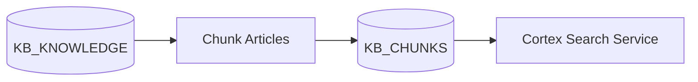

# Knowledge Builder

A Snowflake-native application for building, testing, and analyzing knowledge bases with Cortex Search.

## Overview

This project provides tools for:
- **Knowledge Base Management**: Process and chunk HTML documents for search
- **Search Testing**: Baseline testing with golden/synthetic pairs and ad-hoc search playground
- **Feedback Collection**: User feedback on search quality and relevance
- **Gap Analysis**: Taxonomy-based analysis of knowledge coverage

## Data Pipeline

See [docs/diagrams/pipeline.md](docs/diagrams/pipeline.md) for the complete pipeline diagram.



## Streamlit Applications

- **Feedback App** (`apps/feedback_app/`): Search playground, feedback collection, evaluation, and EDA
- **Taxonomy App** (`apps/taxonomy_app/`): Sunburst visualization for taxonomy drill-down and gap analysis

## Installation

```bash
uv sync                 # Core dependencies
uv sync --group eda     # With EDA capabilities
uv sync --group dev     # With dev tools
```

## Configuration

Create a `.env` file:

```bash
KB_DATABASE_NAME=KNOWLEDGE_BUILDER
KB_SCHEMA_NAME=PUBLIC
SNOW_CONNECTION=default
```

## Usage

```bash
# Run locally
uv run streamlit run apps/feedback_app/streamlit_app.py
uv run streamlit run apps/taxonomy_app/streamlit_app.py

# Deploy
just deploy             # Full deployment (migrations + Streamlit)
just migrate            # Run migrations only
snow streamlit deploy   # Streamlit only
```

## Project Structure

```
knowledge-builder/
├── apps/
│   ├── feedback_app/       # Main feedback/search Streamlit app
│   └── taxonomy_app/       # Taxonomy sunburst visualization app
├── data/                   # Sample data files
├── docs/diagrams/          # Architecture diagrams
├── schemachange/           # Database migrations
│   ├── migrations/         # Versioned migrations (V*)
│   ├── repeatable/         # Repeatable scripts (R*)
│   └── always/             # Always-run scripts (A*)
├── schemachange-config.yml
├── snowflake.yml
└── justfile
```

## Database Schema

See [docs/diagrams/erd.md](docs/diagrams/erd.md) for the entity-relationship diagram.

**Pipeline tables:**
- `KB_KNOWLEDGE`: Source knowledge articles
- `KB_CHUNKS`: Chunked articles for search

**Application tables:**
- `SEARCH_QUERIES`: Logged search queries and responses
- `SEARCH_FEEDBACK`: User feedback on search results
- `GOLDEN_PAIRS`: Baseline test query/answer pairs
- `SYNTHETIC_PAIRS`: LLM-generated test pairs with scoring
- `EVALUATION_RESULTS`: Evaluation metrics and test results

**Cortex services:**
- `KB_SEARCH`: Cortex Search Service on `KB_CHUNKS.CHUNK_TEXT`

### Migrations

SQL migrations use [schemachange](https://github.com/Snowflake-Labs/schemachange). Script types:
- **Versioned (V)**: Run once, tracked in change history
- **Repeatable (R)**: Re-run when content changes
- **Always (A)**: Run on every deployment

```bash
just migrate
```

## Development

```bash
just check    # Run all checks
just fmt      # Format code
```
