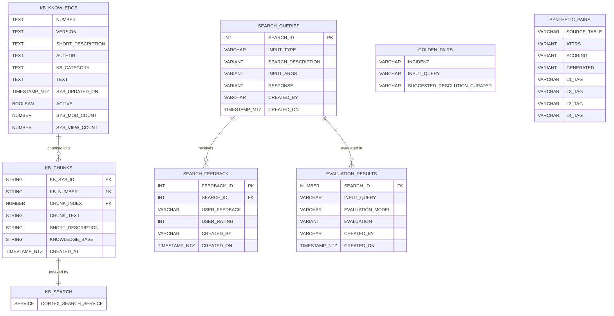

# Entity-Relationship Diagram

```mermaid
erDiagram
    KB_KNOWLEDGE {
        TEXT NUMBER
        TEXT VERSION
        TEXT SHORT_DESCRIPTION
        TEXT AUTHOR
        TEXT KB_CATEGORY
        TEXT TEXT
        TIMESTAMP_NTZ SYS_UPDATED_ON
        BOOLEAN ACTIVE
        NUMBER SYS_MOD_COUNT
        NUMBER SYS_VIEW_COUNT
    }

    KB_CHUNKS {
        STRING KB_SYS_ID PK
        STRING KB_NUMBER FK
        NUMBER CHUNK_INDEX PK
        STRING CHUNK_TEXT
        STRING SHORT_DESCRIPTION
        STRING KNOWLEDGE_BASE
        TIMESTAMP_NTZ CREATED_AT
    }

    SEARCH_QUERIES {
        INT SEARCH_ID PK
        VARCHAR INPUT_TYPE
        VARIANT SEARCH_DESCRIPTION
        VARIANT INPUT_ARGS
        VARIANT RESPONSE
        VARCHAR CREATED_BY
        TIMESTAMP_NTZ CREATED_ON
    }

    SEARCH_FEEDBACK {
        INT FEEDBACK_ID PK
        INT SEARCH_ID FK
        VARCHAR USER_FEEDBACK
        INT USER_RATING
        VARCHAR CREATED_BY
        TIMESTAMP_NTZ CREATED_ON
    }

    EVALUATION_RESULTS {
        NUMBER SEARCH_ID FK
        VARCHAR INPUT_QUERY
        VARCHAR EVALUATION_MODEL
        VARIANT EVALUATION
        VARCHAR CREATED_BY
        TIMESTAMP_NTZ CREATED_ON
    }

    GOLDEN_PAIRS {
        VARCHAR INCIDENT
        VARCHAR INPUT_QUERY
        VARCHAR SUGGESTED_RESOLUTION_CURATED
    }

    SYNTHETIC_PAIRS {
        VARCHAR SOURCE_TABLE
        VARIANT ATTRS
        VARIANT SCORING
        VARIANT GENERATED
        VARCHAR L1_TAG
        VARCHAR L2_TAG
        VARCHAR L3_TAG
        VARCHAR L4_TAG
    }

    KB_SEARCH {
        SERVICE CORTEX_SEARCH_SERVICE
    }

    KB_KNOWLEDGE ||--o{ KB_CHUNKS : "chunked into"
    KB_CHUNKS ||--|| KB_SEARCH : "indexed by"
    SEARCH_QUERIES ||--o{ SEARCH_FEEDBACK : "receives"
    SEARCH_QUERIES ||--o{ EVALUATION_RESULTS : "evaluated in"
```
