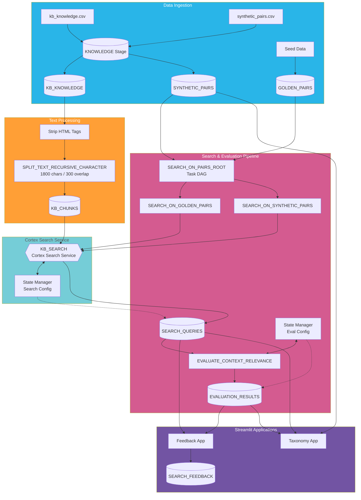

# Knowledge Builder Pipeline

## Complete Pipeline Diagram

## Pipeline Stages

### 1. Data Ingestion
- **kb_knowledge.csv**: ServiceNow knowledge articles exported to CSV
- **synthetic_pairs.csv**: LLM-generated query/resolution pairs with L1-L4 taxonomy tags
- **Seed Data**: Curated golden pairs for baseline testing

### 2. Text Processing
- Strip HTML tags using regex
- Split text using `SPLIT_TEXT_RECURSIVE_CHARACTER` (1800 chars, 300 overlap)
- Output stored in `KB_CHUNKS` table with composite key (KB_SYS_ID, CHUNK_INDEX)

### 3. Cortex Search Service
- `KB_SEARCH` service indexes `CHUNK_TEXT` column
- Attributes: KB_SYS_ID, KB_NUMBER, KNOWLEDGE_BASE, etc.
- Target lag: 1 hour
- **State Manager (Search Config)**: Tracks search service configuration for A/B testing

### 4. Search & Evaluation Pipeline
- Task DAG (`SEARCH_ON_PAIRS_ROOT`) orchestrates parallel search execution
- Results stored in `SEARCH_QUERIES` with INPUT_TYPE (GOLDEN_PAIR or SYNTHETIC_PAIR)
- Context relevance evaluation with chain-of-thought reasoning
- Scores and reasoning stored in `EVALUATION_RESULTS`
- **State Manager (Eval Config)**: Tracks evaluation parameters (framework, model, prompts, thresholds) for A/B testing

### 5. Streamlit Applications
- **Feedback App**: Quality coverage, evaluation, playground, feedback collection, EDA
- **Taxonomy App**: Sunburst visualization, KPI metrics, KB leaderboard, gap analysis
