# P67 (Cortex Mesh) — Architecture Guide

> **Audience**: Snowflake engineers and AI agents onboarding to dogfood/test P67.
> This document covers the system architecture, component interactions, data flows, and deployment topology.

---

## What is P67?

P67 (codename "Cortex Mesh") is an experimental platform for building, deploying, and executing **agentic workflows** on Snowflake. Users write workflow code in TypeScript or Python, package it, deploy it to a control plane service ("controld"), and execute it — either locally via Docker or in production on Snowflake SPCS (Snowpark Container Services). Workflows get access to a rich SDK with Snowflake-native capabilities: SQL execution, Cortex AI (LLM completion, embeddings, agents, analyst), OAuth, HTTP, email, sub-workflows, and human-in-the-loop (HITL) interrupts.

---

## High-Level Architecture

The system is organized into four layers: user interfaces, a control plane, an execution layer, and a data layer.

**User Interfaces** — Four entry points exist for triggering workflows:
- **p67 CLI** (Bun + Commander.js): The primary developer tool. Authenticates to controld via a Snowflake Personal Access Token (PAT). Used for deploying, running, and managing workflows from the terminal.
- **Dashboard** (React + Mantine): A web UI served as a separate SPCS service. Authenticates via the `sf-context-current-user` header injected by Snowflake's ingress proxy.
- **Slack Bot**: Connects via Socket Mode (WebSocket) and HTTP webhooks. Supports slash commands (`/p67-workflow run|list|status|link|help`) and interactive buttons for HITL approvals.
- **Snowflake External Function**: A SQL-callable function (`app.trigger_new_user_workflow(variant)`) that forwards rows to controld's webhook endpoint, allowing workflows to be triggered directly from SQL queries.

**Control Plane** — A single Fastify service called **controld** that handles all business logic: workflow CRUD, execution orchestration, secret management, OAuth token lifecycle, HITL interrupt coordination, and Slack integration. It is the only component that talks to the database.

**Execution Layer** — Workflows run inside isolated **p67-runner** containers. Controld spawns them via one of two adapters:
- **Docker Adapter** (local dev): Runs `docker run -i` with the workflow directory mounted read-only. IPC happens over stdin/stdout.
- **SPCS Adapter** (production): Uploads workflow files to a Snowflake stage, then runs `EXECUTE JOB SERVICE` with an inline spec. Results are read back from a shared volume.

**Data Layer** — Three storage backends:
- **PostgreSQL** (via Prisma ORM): Stores users, workflows, runs, logs, secrets, and HITL interrupts.
- **File Storage**: Workflow ZIP artifacts are extracted to disk (or a Snowflake stage in SPCS).
- **Snowflake**: The runner container connects directly to Snowflake for SQL execution, Cortex AI calls, and secret retrieval.


<details><summary>View Mermaid source</summary>

See [`diagrams/01-high-level-architecture.mmd`](diagrams/01-high-level-architecture.mmd)

</details>

---

## Repository Structure

P67 is a pnpm monorepo with three top-level source directories: `packages/` for shared libraries, `services/` for backend services, and `tools/` for developer-facing CLI tools. The `native-app/` directory contains the Snowflake Native Application definition that packages everything for SPCS deployment.


<details><summary>View Mermaid source</summary>

See [`diagrams/02-repository-structure.mmd`](diagrams/02-repository-structure.mmd)

</details>

### Key directories

| Path | Package | Purpose |
|---|---|---|
| `packages/db/` | `@p67/db` | Prisma schema, migrations, Fastify plugin for PostgreSQL |
| `packages/workflow-sdk/` | `@p67/workflow-sdk` | TypeScript type definitions for the Workflow SDK |
| `packages/workflow-sdk-python/` | `p67-workflow-sdk` | Full Python implementation of the Workflow SDK |
| `packages/web/` | `@p67/web` | React + Mantine frontend (scaffold; Slack linking page) |
| `services/controld/` | `@p67/controld` | Core control plane — workflow CRUD, execution, secrets, OAuth, HITL, Slack, webhooks |
| `tools/p67-cli/` | `@p67/cli` | CLI for deploy/run/manage workflows (Bun + Commander.js) |
| `tools/dash/` | — | Dashboard image build (separate from `packages/web`) |
| `native-app/` | — | Snowflake Native App manifest + setup SQL |
| `example_workflows/` | — | Sample workflows for reference |

---

## Controld API Routes

Controld exposes a REST API under `/api` with Swagger documentation at `/docs`. All routes (except `/webhook`) require authentication — either a Snowflake PAT (`Authorization: Snowflake Token="..."`) from the CLI, or the `sf-context-current-user` header from the SPCS ingress proxy.

The API is organized into six route groups:

- **`/workflow`** — Core workflow operations: upload a ZIP (`POST /create`), list accessible workflows with RBAC filtering (`GET /list`), execute a workflow asynchronously (`POST /:id/run`), poll for results (`GET /runs/:runId`), manage visibility (`PATCH /:id/visibility`), and handle HITL interrupts (`GET|POST /interrupts`). Workflows can also be run by name (`POST /name/:name/run`), which always targets the latest version.
- **`/secret`** — Encrypted secret storage: save, list, retrieve, and delete secrets. Supports both plain secrets and OAuth tokens. OAuth tokens can be refreshed via `POST /oauth/refresh`.
- **`/log`** — Structured log querying: list logs with filters by workflow, run, source, and time range. Also provides a run history endpoint (`GET /runs`) for listing all runs of a given workflow.
- **`/auth`** — OAuth flows: Google OAuth authorization/callback, and Slack account linking.
- **`/whoami`** — Returns the authenticated user's identity.
- **`/webhook`** (no auth) — Inbound webhooks: Slack interactive buttons, Slack slash commands, and Snowflake external function calls. The Slack endpoints verify requests using the signing secret; the Snowflake endpoint accepts batch-row format (`{"data": [[0, <variant>], ...]}`).


<details><summary>View Mermaid source</summary>

See [`diagrams/03-controld-api-routes.mmd`](diagrams/03-controld-api-routes.mmd)

</details>

---

## Data Model

The PostgreSQL database (managed by Prisma) contains seven models:

- **User**: Keyed by `snowflakeUser` (the Snowflake username). Every other model ultimately links back to a user for RBAC.
- **SlackUser**: Links a Slack user/team pair to a P67 User, enabling Slack-based workflow triggers and HITL approvals.
- **Workflow**: A deployed workflow artifact. Multiple Workflow records can share the same `name` — each one is a version. The `storagePath` points to the extracted ZIP on disk. Visibility is either `Private` (owner-only) or `Public` (anyone can run).
- **WorkflowRun**: A single execution of a workflow. Tracks status (`Running`, `Completed`, `Failed`, `Cancelled`, `Interrupted`), the JSON result payload, and exit code. This is the record polled by the CLI during async runs.
- **Log**: Structured log entries produced during a run. Each log has a `source` (`RuntimeHost`, `WorkflowNode`, or `ToolCall`), a message, and a JSON attributes bag. Denormalized `workflowId` and `userId` fields enable efficient filtered queries without joins.
- **Secret**: Encrypted secrets owned by a user. Supports two types: regular `Secret` and `OAuth` tokens. Secrets are encrypted at rest using an AES-256 key provided via the `ENCRYPTION_KEY` environment variable.
- **WorkflowInterrupt**: Records a HITL pause within a run. Contains the interrupt `payload` (the question/form shown to the human), and once resumed, the human's `response`. Status transitions from `Pending` to `Resumed` or `Expired`.


<details><summary>View Mermaid source</summary>

See [`diagrams/04-data-model.mmd`](diagrams/04-data-model.mmd)

</details>

---

## Workflow Lifecycle

A workflow goes through three phases: build/deploy, execute, and (optionally) interrupt/resume. Each phase involves different components communicating across process and container boundaries.

### Deploy

Deployment starts on the developer's machine. The CLI bundles the workflow source code (using `Bun.build` for TypeScript or a simple copy for Python), extracts the LangGraph topology into a `graph.json` for visualization, and packages everything into a `workflow.zip`. The CLI then uploads this ZIP to controld via a multipart `POST /api/workflow/create` request. Controld extracts the ZIP to its local storage directory, parses the `manifest.yaml` to determine the workflow name and visibility, and inserts a Workflow record into PostgreSQL. The returned `workflowId` is saved to a `.p67` state file in the project directory so subsequent `p67 workflow run` commands know which workflow to target.

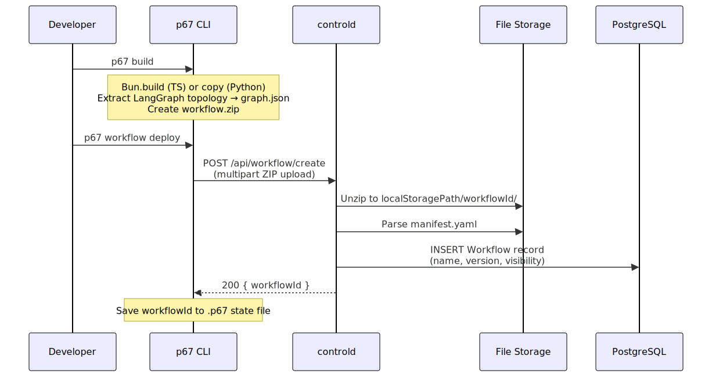

<details><summary>View Mermaid source</summary>

See [`diagrams/05-deploy-flow.mmd`](diagrams/05-deploy-flow.mmd)

</details>

### Execute (Async)

Execution is asynchronous by default. The CLI sends `POST /api/workflow/:id/run` and immediately receives a `202` response with a `runId`. Controld creates a `WorkflowRun` record (status=`Running`), then begins background execution:

1. **Config hydration**: Controld parses the workflow's `manifest.yaml`, resolves parameter values, decrypts referenced secrets, and refreshes any OAuth tokens.
2. **Container spawn**: Based on the runtime environment, controld uses either the Docker adapter (`docker run -i -v <path>:/workflow:ro <image>`) or the SPCS adapter (`EXECUTE JOB SERVICE` with workflow files uploaded to a Snowflake stage).
3. **IPC**: Controld sends a `RunWorkflow` NDJSON message to the runner's stdin containing the hydrated config, parameters, and credentials. The runner loads the workflow's entry point (`index.js` or `main.py`), creates a `WorkflowSDK` instance, and calls `main(sdk)`.
4. **SDK calls**: During execution, the workflow uses the SDK to call Snowflake SQL, Cortex AI, HTTP endpoints, etc. These calls go directly from the runner container to Snowflake — they do not route through controld.
5. **Completion**: The runner sends a `{ type: "result", data: ... }` message back to controld over stdout. Controld updates the `WorkflowRun` record with the result and status=`Completed`.

Meanwhile, the CLI polls `GET /api/workflow/runs/:runId` every 2 seconds until the status is no longer `Running`.

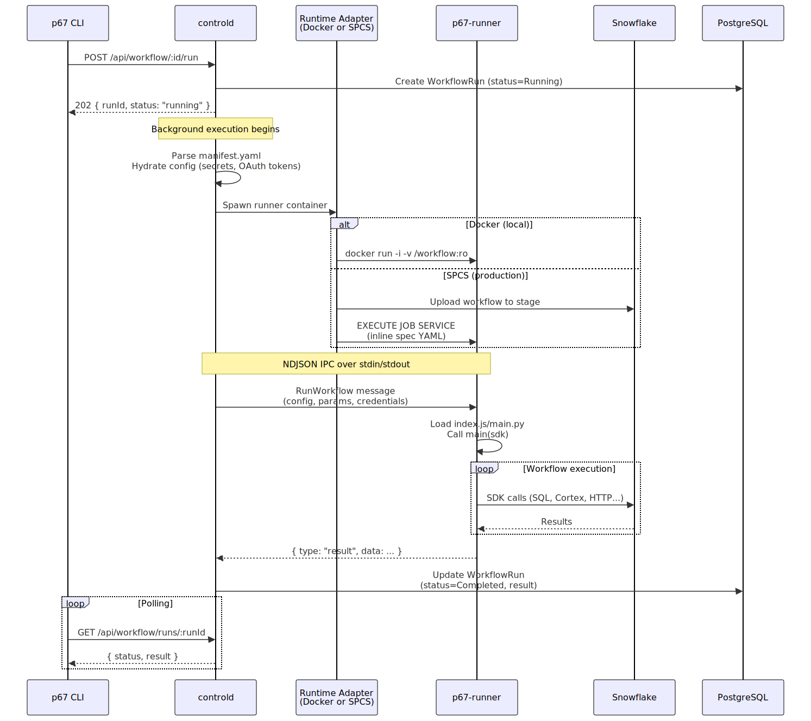

<details><summary>View Mermaid source</summary>

See [`diagrams/06-execute-flow.mmd`](diagrams/06-execute-flow.mmd)

</details>

### Human-in-the-Loop (HITL) Interrupt

Workflows can pause mid-execution to wait for human input. When a workflow calls `sdk.interrupt(payload)`, the runtime host sends an `Interrupt` IPC message to controld. Controld stores a `WorkflowInterrupt` record (status=`Pending`) and updates the run status to `Interrupted`. The runner process remains alive but blocks on stdin, waiting for a resume message.

A human can respond through two channels:
- **API**: `POST /api/workflow/interrupts/:id/resume` with a JSON response body.
- **Slack**: If Slack integration is configured, controld posts an interactive message with action buttons. When the human clicks a button, Slack sends a webhook to `POST /webhook/slack/interactions`, which controld maps to the pending interrupt.

Once a response arrives, controld updates the interrupt record (status=`Resumed`), sends a `ResumeInterrupt` message to the runner via stdin, and the workflow continues from where it left off.

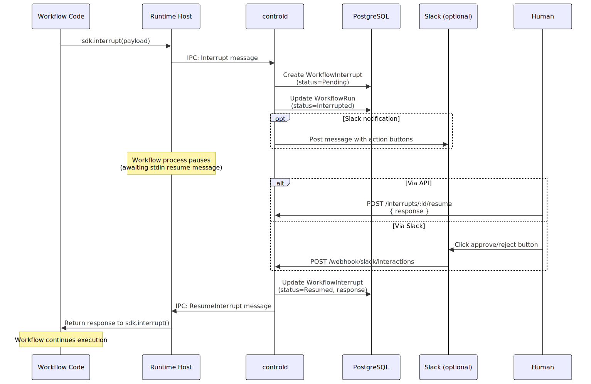

<details><summary>View Mermaid source</summary>

See [`diagrams/07-hitl-interrupt-flow.mmd`](diagrams/07-hitl-interrupt-flow.mmd)

</details>

---

## Workflow SDK Capabilities

 The SDK is injected into every workflow at runtime. Both TypeScript and Python versions expose the same interface. Key capabilities include SQL execution, Cortex AI (LLM completion, agents, analyst), HTTP, email, HITL interrupts, subworkflows, and **Cortex Code** (`cortexCode`) — which spawns the `cortex` CLI as a subprocess, optionally loading a named profile with skills downloaded from Snowflake stages (or bundled as a fallback). See `docs/plans/coco-profile-lifecycle.md` for details on how profiles and skills work in SPCS.


<details><summary>View Mermaid source</summary>

See [`diagrams/08-workflow-sdk.mmd`](diagrams/08-workflow-sdk.mmd)

</details>

---

## MCP Integration (Workflows as MCP Clients)

P67 workflows can connect to external [Model Context Protocol (MCP)](https://modelcontextprotocol.io) servers as clients. This enables workflows to use tools exposed by services like Atlassian Jira/Confluence, GitHub, Slack, or any MCP-compatible server.

### Pattern

```
P67 Workflow (SPCS container)
  └── @modelcontextprotocol/sdk (MCP Client)
        └── StreamableHTTPClientTransport
              └── https://remote-mcp-server.com/mcp
                    ├── Auth (Basic, Bearer, or OAuth)
                    ├── client.listTools()
                    └── client.callTool({ name, arguments })
```

### How it works

1. **Credentials** are stored as Snowflake secrets and referenced via `secretRef` in the manifest. The SDK resolves them at runtime via `sdk.getParameter()`.
2. **Network egress** requires the MCP server hostname to be listed in the External Access Integration (EAI) network rule. For the P67 app, this is the `SNOWFLAKE_EGRESS_EAI` reference configured in `native-app/configure_callbacks.sql`.
3. **The workflow** uses `@modelcontextprotocol/sdk` to create a `Client`, connect via `StreamableHTTPClientTransport` (or `SSEClientTransport` for older servers), discover tools with `client.listTools()`, and call them with `client.callTool()`.

### Atlassian MCP example

The `workflows/test/jira_mcp/` PoC demonstrates this pattern with Atlassian's remote MCP server (`mcp.atlassian.com`). Key learnings:

- **Auth**: Basic Auth (`base64(email:api_token)`) — the API token must be created with the **Rovo MCP** scope, not the "Jira" scope. Without the correct scope, only Teamwork Graph read-only tools are available.
- **CloudId**: API token auth is not bound to a specific Atlassian site. The workflow must first call `getAccessibleAtlassianResources` to resolve the `cloudId`, then pass it to every tool call.
- **Tools**: With proper scoping, 37 tools are available (Jira CRUD, Confluence CRUD, JSM Ops, Teamwork Graph, Rovo Search).

### Adding new MCP server hosts

To allow workflows to reach a new MCP server:

1. Add the hostname to the `SNOWFLAKE_EGRESS_EAI` callback in `native-app/configure_callbacks.sql`
2. For existing deployments, also update the network rule directly:
   ```sql
   ALTER NETWORK RULE P67_APP_DATA.CONFIGURATION.P67_SNOWFLAKE_EGRESS_EAI_NETWORK_RULE
     SET VALUE_LIST = ('<existing hosts>', '<new-mcp-host>');
   ```

---

## Deployment Topology

### Local Development

For local development, `docker compose` brings up two services: a PostgreSQL 17 instance and the controld service. Controld mounts the host's Docker socket (`/var/run/docker.sock`) so it can spawn p67-runner containers on the same Docker engine. Each workflow run creates a new ephemeral runner container with the workflow directory bind-mounted as a read-only volume. Communication between controld and the runner happens over the container's stdin/stdout via the NDJSON protocol.


<details><summary>View Mermaid source</summary>

See [`diagrams/09-local-development.mmd`](diagrams/09-local-development.mmd)

</details>

**How to start**:
```bash
make dev
# Generates encryption key, starts postgres + controld, runs migrations, tails logs
# controld available at http://localhost:3002
# Swagger docs at http://localhost:3002/docs
```

### Snowflake SPCS (Production)

In production, P67 runs as a Snowflake Native Application. The app creates two compute pools:

- **service_compute_pool** (1-5 nodes, `cpu_x64_xs`): Runs controld and the dashboard as long-lived SPCS services with public ingress endpoints.
- **runner_compute_pool** (1-10 nodes, `cpu_x64_xs`): Runs workflow executions as ephemeral job services (`EXECUTE JOB SERVICE`). Each workflow run gets its own isolated container.

Workflow files are uploaded to an encrypted Snowflake stage (`app.workflow_stage`) before each run. The runner container mounts this stage at `/workflow` and writes results to a shared `/results` volume that controld reads after completion.

The native app requires the consumer to bind several external references: External Access Integrations for Google OAuth, Snowflake API egress, and Postgres connectivity, plus secrets for the Postgres connection URL, encryption key, Google OAuth credentials, and (optionally) Slack tokens. These are configured during the `v1.create_services()` grant callback.

Container images are stored in the provider account's image repository (`p67_src/core/img_repo` for controld and runner, `p67_src/dash/img_repo` for the dashboard) and referenced by the native app manifest.


<details><summary>View Mermaid source</summary>

See [`diagrams/10-spcs-production.mmd`](diagrams/10-spcs-production.mmd)

</details>

**How to deploy**:
```bash
# One-command deploy (login, build images, push to registry, snow app run)
make deploy

# Or step-by-step:
make login              # Authenticate with Snowflake image registry
make build              # Build controld + dashboard Docker images (linux/amd64)
make push               # Push to Snowflake image repository
snow app run            # Create/update the native app
```

---

## IPC Protocol (controld ↔ runner)

Communication between controld and the runner container uses **newline-delimited JSON (NDJSON)** over stdin/stdout.

| Direction | Message Type | Purpose |
|---|---|---|
| controld → runner | `RunWorkflow` | Start execution with config, params, credentials |
| controld → runner | `ResumeInterrupt` | Provide human response to a pending interrupt |
| controld → runner | `OAuthTokenResponse` | Return refreshed OAuth token |
| runner → controld | `{ type: "result", data }` | Workflow completed successfully |
| runner → controld | `ThrowError` | Workflow failed with error |
| runner → controld | `Interrupt` | Workflow paused for human input |
| runner → controld | `RequestOAuthToken` | Request OAuth token refresh |

> **Note**: stdout is reserved exclusively for IPC. The runtime host redirects `console.log/info/warn` to stderr so workflow print statements don't corrupt the protocol.

---

## CLI Command Reference

The `p67` CLI is the primary developer interface, built with Bun and Commander.js. It manages the full workflow lifecycle and stores connection details in `~/.snowflake/p67/config.toml`.

Key command groups:
- **`p67 init`**: Scaffolds a new workflow project from built-in TypeScript or Python templates, including a `manifest.yaml` and build configuration.
- **`p67 build`**: Bundles the workflow source, extracts the LangGraph graph topology (if applicable), and creates a `workflow.zip` ready for deployment.
- **`p67 workflow`**: Deploy, run, list, delete, and inspect workflows. The `run` command supports interactive parameter prompts (derived from the manifest) and async polling with a spinner.
- **`p67 secret`**: Save, list, and delete encrypted secrets stored server-side.
- **`p67 oauth`**: Run full OAuth authorization flows for supported providers (Google, GitHub, Slack, Microsoft, Linear, Notion). Spins up a local HTTPS callback server, opens the browser, and exchanges the code for tokens.
- **`p67 connection`**: Manage named connections to controld instances (add, list, remove, set-default). Each connection stores an endpoint URL and PAT.
- **`p67 manifest from-connection`**: Generate a `manifest.yaml` config block from an existing Snowflake connection, reducing manual configuration.


<details><summary>View Mermaid source</summary>

See [`diagrams/11-cli-commands.mmd`](diagrams/11-cli-commands.mmd)

</details>

---

## Native App Lifecycle

P67 is packaged as a Snowflake Native Application (manifest v2) and managed entirely through stored procedures. The lifecycle progresses through several states:

1. **Installed**: `snow app run` creates the application from the package. The `v1.init()` version initializer fires automatically, which ALTERs existing services with the correct External Access Integrations, discovers the controld service DNS name, and configures the dashboard to point at it. It also creates the `trigger_new_user_workflow` service function for the Snowflake external function webhook.

2. **Services Created**: The consumer calls `v1.create_services()` (the grant callback). This creates two compute pools (`service_compute_pool` for controld + dashboard, `runner_compute_pool` for workflow jobs), an encrypted workflow stage, and starts both services. This is where the actual compute resources are provisioned.

3. **Running**: Both services are active with public ingress endpoints. Workflows can be deployed and executed. The `v1.app_url()` and `v1.dashboard_url()` procedures return the ingress URLs.

4. **Stopped**: `app.stop_app()` drops both services (using `FORCE` for controld to handle active connections). Compute pools remain but are idle. Services can be restarted with `v1.start_controld()` and `v1.start_dashboard()`.


<details><summary>View Mermaid source</summary>

See [`diagrams/12-native-app-lifecycle.mmd`](diagrams/12-native-app-lifecycle.mmd)

</details>

**App roles**:
- `app_admin` — Full access: create services, manage compute pools, configure references
- `app_user` — Use workflows: access service endpoints, view URLs

---

## Getting Started (for Dogfooding)

P67 is already deployed as a Snowflake Native Application in the target account. You do **not** need to build Docker images, push to a registry, or run `make deploy`. The steps below get you from zero to running your first workflow.

### Step 1: Get Access

Request the **`P67_USER_RL`** role via a Lift ticket (or ask a SECURITYADMIN to grant it). This role gives you:
- `USAGE` on the `P67` database and the `COCO_SKILLS` schema
- `READ` on the skill stage (`P67.COCO_SKILLS.P67_CLI`)

This is the only prerequisite — the role grants access to both the deployed P67 app and the CoCo profile that teaches your CoCo agent how to use it.

### Step 2: Install the CoCo Profile

The **P67 CoCo profile** gives Cortex Code (CoCo) a skill that knows the entire P67 CLI — every command, flag, and workflow pattern. Once installed, CoCo can scaffold, build, deploy, and run workflows on your behalf.

Run the onboarding script from the repo (or do it manually):

**Option A — Automated setup:**
```bash
./ops/coco-profile/setup.sh
```

This will:
1. Create (or reuse) a `[snowhouse]` connection in `~/.snowflake/connections.toml` pointing to `SFCOGSOPS-SNOWHOUSE_AWS_US_WEST_2` with `externalbrowser` auth and the `ENGINEER` role.
2. Run `cortex profile add p67 -c snowhouse` to pull the profile from the registry.
3. Run `cortex profile set-default p67` to activate it in all CoCo sessions.

**Option B — Manual setup:**
```bash
# Add the profile (a browser window will open for Snowflake auth)
cortex profile add p67 -c snowhouse

# Set it as default so it loads in every session
cortex profile set-default p67
```

**Verify it works:**
```bash
cortex -c snowhouse
# Inside the CoCo session:
/skill list
# You should see "p67-cli" in the list
```

**To update the profile later** (after the P67 team publishes new skill versions):
```bash
cortex profile sync p67 -c snowhouse
```

> **Note**: The profile only works in CoCo Desktop and CoCo CLI. Snowsight's CoCo panel does not support profiles.

### Step 3: Configure the CLI Connection

Before deploying workflows, the `p67` CLI needs to know where controld is running. Get the controld ingress URL from the app admin or by running:

```sql
CALL p67.v1.app_url();
```

Then add a connection:

```bash
p67 connection add prod --endpoint <controld-ingress-url> --set-default
```

You'll be prompted for a Snowflake Personal Access Token (PAT). Generate one via Snowsight (User menu > Profile > Personal Access Tokens) or the Snow CLI.

### Step 4: Create Your First Workflow

You can do this manually or let CoCo do it for you.

**With CoCo** (recommended — the p67-cli skill guides the agent):
```
> Create a new P67 workflow called "hello-world" that queries Snowflake
  for the current timestamp and returns it
```

CoCo will run `p67 init`, edit the source code, `p67 build`, `p67 workflow deploy`, and `p67 workflow run` — walking you through each step.

**Manually:**

```bash
# Scaffold a new project (TypeScript or Python)
p67 init my-workflow
cd my-workflow

# Configure your Snowflake connection in the manifest
p67 manifest from-connection

# Edit src/index.ts (or src/main.py for Python)
# Your entrypoint: export async function main(sdk: WorkflowSDK) { ... }

# Build, deploy, run
p67 build
p67 workflow deploy
p67 workflow run --name my-workflow
```

### What the CoCo Profile Includes

The P67 profile installs one skill: **`p67-cli`**. This skill is loaded from a Snowflake stage (`@P67.COCO_SKILLS.P67_CLI/skills/p67-cli/`) and teaches CoCo:

- **Full CLI reference**: Every command (`init`, `build`, `workflow deploy/run/list/delete`, `secret`, `oauth`, `connection`, `logs`, `manifest`) with all flags and options.
- **Common workflows**: Zero-to-running, deploy with parameters, OAuth setup, secrets management, switching environments.
- **Stopping points**: The skill instructs CoCo to always ask before deploying, running with params, saving secrets, or deleting anything — so it won't take destructive actions without confirmation.
- **Troubleshooting**: Common errors (`command not found`, `connection refused`, `409 Conflict`, timeouts, OAuth failures) with resolutions.

The profile does **not** include MCP servers, hooks, env vars, or settings overrides — it is purely a knowledge skill that makes CoCo effective at operating the P67 CLI.

### Example Workflow (TypeScript)

```typescript
import type { WorkflowSDK } from '@p67/workflow-sdk';

export async function main(sdk: WorkflowSDK) {
  // Execute SQL
  const result = await sdk.executeQueryReadOnly('SELECT CURRENT_TIMESTAMP() AS ts');

  // Use Cortex AI
  const summary = await sdk.cortexComplete({
    model: 'claude-3-5-sonnet',
    prompt: `Summarize this data: ${JSON.stringify(result)}`,
  });

  // Human-in-the-loop
  const approval = await sdk.interrupt({
    question: 'Approve this summary?',
    summary: summary,
  });

  return { summary, approved: approval.response };
}
```

### Using CoCo Profiles in Workflows

Workflows can invoke the Cortex Code CLI as a subprocess via `sdk.cortexCode()`. Passing a `profile` name causes the SDK to:

1. Fetch the profile from `CORTEX_CODE.CONFIG.PROFILE_REGISTRY`
2. Download skills from stages referenced in the profile's `SKILL_REPOS` column
3. Fall back to bundled skills from the workflow's `skills/` directory if stage download fails

```typescript
const result = await sdk.cortexCode({
  prompt: 'What is the secret code?',
  profile: 'my-profile',   // fetched from CORTEX_CODE.CONFIG.PROFILE_REGISTRY
  timeout: 120,
});
```

**Option A: Skills on a stage (recommended)**

Upload skills to a Snowflake stage and reference it in `SKILL_REPOS`:

```sql
PUT file:///path/to/my-skill/SKILL.md @MY_DB.MY_SCHEMA.MY_STAGE/skills/my-skill/SKILL.md
    AUTO_COMPRESS=FALSE OVERWRITE=TRUE;

UPDATE CORTEX_CODE.CONFIG.PROFILE_REGISTRY
SET SKILL_REPOS = '[{"snowflake_stage": "@MY_DB.MY_SCHEMA.MY_STAGE/skills/"}]'
WHERE CONFIG_NAME = 'my-profile';

-- Grant READ to the runner role
GRANT READ ON STAGE MY_DB.MY_SCHEMA.MY_STAGE TO ROLE P67_USER_RL;
```

**Option B: Bundled skills (self-contained fallback)**

```
my-workflow/
├── skills/
│   └── my-skill/
│       └── SKILL.md    <- copied from disk at runtime
├── src/
│   └── index.ts
└── manifest.yaml
```

`p67 build` includes `skills/` in the zip automatically. Skills are auto-discovered by CoCo from their `description` frontmatter field — no `$skill-name` prefix in the prompt is required (though it works if used). Stage skills override bundled skills of the same name.

> **How it works**: The SDK downloads skills from stages using its own SQL connection (not CoCo's internal driver, which has PAT auth issues in SPCS). It runs `LIST @stage/skills/` to find skill directories, then `SELECT $1::VARCHAR` to read each file. See [`docs/plans/coco-profile-lifecycle.md`](plans/coco-profile-lifecycle.md) for the full runtime flow.

See [`workflows/test/coco-profile/`](../workflows/test/coco-profile/) for a working example.

---

## Key Configuration Files

| File | Purpose |
|---|---|
| `p67/compose.yaml` | Local dev: postgres + controld Docker services |
| `p67/Dockerfile` | Multi-stage build for controld (and runner) image |
| `p67/snowflake.yml` | Snowflake CLI config: app package, database, registry |
| `p67/Makefile` | Build, push, deploy, and operational commands |
| `p67/native-app/manifest.yml` | Native App manifest: images, references, privileges |
| `p67/native-app/setup.sql` | Native App stored procedures and roles |
| `p67/packages/db/prisma/schema.prisma` | Database schema (7 models) |
| `~/.snowflake/p67/config.toml` | CLI connection config (endpoint + PAT per connection) |
| `<workflow>/manifest.yaml` | Per-workflow config: params, secrets, runtime settings |

---

## Tech Stack Summary

| Layer | Technology |
|---|---|
| **CLI** | Bun, Commander.js, Inquirer, Zod |
| **Control Plane** | Fastify 5, Prisma, Pino, Zod, adm-zip |
| **Frontend** | React 19, Vite 7, Mantine v8 |
| **Database** | PostgreSQL 17 (via Prisma ORM) |
| **Workflow SDKs** | TypeScript (types-only) + Python (full implementation) |
| **Container Runtime** | Docker (local) / Snowflake SPCS (production) |
| **Native App** | Snowflake Native Application Framework v2 |
| **CI / Lint** | Biome (replaces ESLint + Prettier) |
| **Package Manager** | pnpm 10 (workspaces) |
