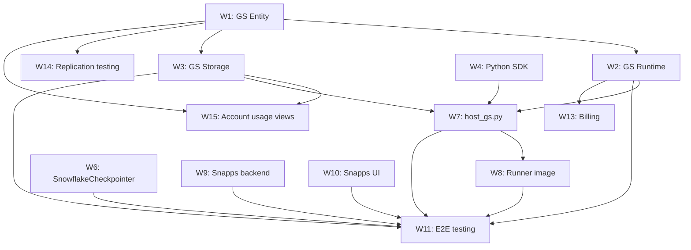

# P67 → GS Migration Tracker

**Last updated:** 2026-04-13  
**Author:** Coco session (seed for all future sessions — update this line when you modify)  
**Purpose:** Machine-readable checklist. Any Coco session should read this first to orient on current state.

---

## Workstream Status

| # | Workstream | Repo | Status | PRs / Links |
|---|-----------|------|--------|-------------|
| W1 | GS Entity (Domain, DPO, VStage, DDL, security) | snowflake | ~80% done | PR 422682 (Nathan), PRs 423175–423178 (ours) |
| W2 | GS Runtime (SPCS job launch, Spring DI wiring) | snowflake | Stubbed (`AutomationJobLauncher`) | PR 423177 |
| W3 | GS Storage (Hybrid Table bootstrap, system session) | snowflake | Stubbed (`AutomationHybridTableBootstrapper`) | PR 423178 |
| W4 | Unified Python SDK (`AutomationContext` ABC + `LocalBackend`) | aura | In progress | — |
| W5 | TS SDK | — | Decision: GS is Python-first; TS stays on controld path | — |
| W6 | `SnowflakeCheckpointer` | aura | **Done** | PR 705 |
| W7 | GS-aware runner host (`host_gs.py`) | aura | Not started | Depends: W2, W3 |
| W8 | Runner image (Dockerfile updates) | aura | Not started | Depends: W7 |
| W9 | PEP backend (Snapps) | snapps | Bootstrapping (separate session) | — |
| W10 | Snapps UI | snapps | Bootstrapping (separate session) | — |
| W11 | E2E testing | — | Not started | Depends: W2, W3, W7, W8 |
| W12 | DBSec + Compiler review | Manual (Slack) | Docs ready, not posted | #db-security-eng, #compiler-discuss |
| W13 | Billing integration | snowflake | Not started | Depends: W2 |
| W14 | Replication testing | snowflake | Param registered, untested | Depends: W1 |
| W15 | Account usage views | snowflake | Not started | Depends: W1, W3 |

---

## Per-Workstream Detail

### W1 — GS Entity
- [x] `AutomationDomain` DPO defined
- [x] VStage wiring (Defa Sun's review passed)
- [x] DDL: `CREATE / ALTER / DROP AUTOMATION`
- [x] Security model (privilege checks)
- [ ] Nathan's PR 422682 merged — waiting on review
- [ ] PRs 423175–423178 stacked and merged

### W2 — GS Runtime
- [x] `AutomationJobLauncher` stub in place (PR 423177)
- [ ] Implement SPCS job launch logic
- [ ] Spring DI wiring for launcher bean
- [ ] Integration test coverage

### W3 — GS Storage
- [x] `AutomationHybridTableBootstrapper` stub in place (PR 423178)
- [ ] Implement Hybrid Table bootstrap (system session)
- [ ] Integration test coverage

### W4 — Unified Python SDK
- [x] `AutomationContext` ABC designed
- [x] `LocalBackend` scaffolded
- [ ] `GSBackend` implementation
- [ ] Unit tests for both backends
- [ ] Published to internal PyPI / included in runner image

### W5 — TS SDK
- [x] Decision made: no GS port needed (controld path unchanged)

### W6 — SnowflakeCheckpointer
- [x] Implementation complete (PR 705 merged)
- [x] Unit tests passing

### W7 — GS-aware runner host (`host_gs.py`)
- [ ] Design `host_gs.py` entry point
- [ ] Wire `GSBackend` context
- [ ] Handle SPCS environment variables / secrets injection
- [ ] Smoke test locally with stubbed GS calls

### W8 — Runner image
- [ ] Identify base image changes needed
- [ ] Add Python SDK dependencies to Dockerfile
- [ ] Push updated image to Snowflake image registry
- [ ] Verify image boots cleanly in SPCS sandbox

### W9 — PEP backend (Snapps)
- [ ] Snapps repo bootstrapping in progress (separate session)
- [ ] Define Snapps ↔ GS API contract
- [ ] Implement GS call-outs from Snapps backend

### W10 — Snapps UI
- [ ] New implementation (not a fork of tools/dash)
- [ ] Bootstrapping in progress (separate session)

### W11 — E2E testing
- [ ] Stand up test SPCS environment
- [ ] Smoke: create automation object, launch job, verify state transitions
- [ ] Checkpoint round-trip test via `SnowflakeCheckpointer`
- [ ] Billing event emitted and visible in usage view

### W12 — DBSec + Compiler review
- [x] Security design doc written (`docs/plans/dbsec-security-design.md`)
- [x] DDL syntax proposal written (`docs/plans/ddl-syntax-proposal.md`)
- [ ] Post to #db-security-eng
- [ ] Post to #compiler-discuss
- [ ] Address feedback and iterate

### W13 — Billing integration
- [ ] Define billing event type for automation execution
- [ ] Wire metering call into `AutomationJobLauncher`
- [ ] Add billing view / usage history entry

### W14 — Replication testing
- [x] Replication parameter registered
- [ ] Write Snowfort test for cross-region replication of automation objects
- [ ] Verify state preserved after failover

### W15 — Account usage views
- [ ] Define `AUTOMATION_HISTORY` view schema
- [ ] Implement in GS (depends on W1 entity + W3 storage)
- [ ] Add Snowfort test coverage

---

## Dependency Graph



**Text form (for non-Mermaid readers):**

```
W1 ──► W2 ──► W7 ──► W8
 │      │      │       │
 │      └──► W13     W11 ◄── W6
 │                    ▲
 ├──► W3 ──► W7 ───►  │
 │      └──► W15      │
 ├──► W14            W9, W10
 └──► W15
W4 ──► W7
```

---

## Completed Items

| Item | File / PR | Notes |
|------|-----------|-------|
| `SnowflakeCheckpointer` | `aura/p67/checkpointer/snowflake_checkpointer.py` · PR 705 | Merged |
| Security design doc | `aura/p67/docs/plans/dbsec-security-design.md` | Ready to post |
| DDL syntax proposal | `aura/p67/docs/plans/ddl-syntax-proposal.md` | Ready to post |
| GS integration plan | `aura/p67/docs/plans/gs-integration-plan.md` | Background reading |
| DPO / VStage entity work | PRs 423175–423178 (stacked) | Pending merge |
| Replication param registered | PR 423175 or 423176 | Untested |

---

## Decisions Log

| Decision | Rationale | Date |
|----------|-----------|------|
| **GS is Python-first; TS stays on controld path** | TS SDK complexity vs. delivery speed. Controld path is stable and already tested. | 2026-04 |
| **Option B (thin adapter) chosen for SDK** | Avoids duplicating orchestration logic; LocalBackend and GSBackend share the same `AutomationContext` ABC contract. | 2026-04 |
| **Snapps UI is a new implementation, not a fork of tools/dash** | tools/dash has too many assumptions baked in; clean slate is faster and avoids tech debt. | 2026-04 |
| **PEP backend lives in the snapps repo** | Keeps the Snapps surface co-located; avoids polluting the aura repo with Snapps-specific concerns. | 2026-04 |

---

## Key Contacts

| Person | Role / Area |
|--------|-------------|
| Mo Eseifan | P67 tech lead |
| Ron Sun | GS entity / DDL |
| Gary Ren | GS runtime / SPCS integration |
| Defa Sun | VStage review |
| @db-security-iam-oncall | DBSec review (Slack handle) |

---

## Key Channels

| Channel | Purpose |
|---------|---------|
| `#file-based-entities` | GS entity work, DPO/VStage questions |
| `#db-security-eng` | DBSec design review |
| `#compiler-discuss` | DDL syntax + compiler review |
| `#sql-parser-help` | Parser questions |

---

## Repos

| Repo | Slug | Notes |
|------|------|-------|
| Snowflake monorepo | `snowflake-eng/snowflake` | GS entity, runtime, storage, billing, views |
| Aura | `snowflake-eng/aura` | Python SDK, runner host, Dockerfile, checkpointer |
| Snapps | TBD | PEP backend + UI (bootstrapping) |
