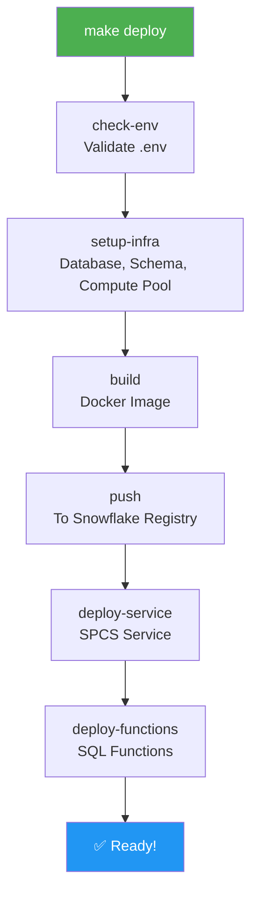

# Sales AI Platform

LangGraph workflows as FastAPI endpoints, deployable to Snowflake SPCS.

## Quick Start

```bash
# Local development
uv sync && make dev
# → http://localhost:8000/docs

# Deploy to Snowflake
cp .env.example .env  # Fill in your values
make deploy           # One command does everything (use PAT in the connection TOML to avoid MFA issues)
```

## Deployment Flow



## Project Structure

```
sales-ai-platform/
├── app.py                    # FastAPI + API schemas
├── graphs/                   # LangGraph workflows
├── release/                  # Snowflake deployment
└── Makefile                  # All commands
```
## Commands

Run `make help` to see all available commands.

**Development:**
- `make dev` - Start with auto-reload
- `make studio` - Open LangGraph Studio

**Deploy to Snowflake:**
- `make deploy` - Full deployment (one command)
- `make check-env` - Validate configuration
- `make build` - Build Docker image
- `make service-status` - Check if running

## Snowflake Setup

### 1. Create Connection
```bash
snow connection add
# Enter: account, user, role, etc.
```

### 2. Configure Environment
```bash
cp .env.example .env
nano .env
```

Required variables:
```bash
SNOW_CONNECTION=myconnection  # From ~/.snowflake/connections.toml
DATABASE=SALES_AI
SCHEMA=PLATFORM
SERVICE_NAME=sales_ai_service
# ... see .env.example for all
```

### 3. Deploy
```bash
make deploy
# Creates all resources
# Deploys service & functions
```

## Adding Workflows

**1. Create graph** (`graphs/my_workflow.py`):
```python
from pydantic import BaseModel, Field
from langgraph.graph import StateGraph, START, END

class MyState(BaseModel):
    input: str
    result: str = None
    class Config:
        arbitrary_types_allowed = True

def process(state: MyState) -> dict:
    return {"result": f"Processed: {state.input}"}

def create_graph():
    workflow = StateGraph(MyState)
    workflow.add_node("process", process)
    workflow.add_edge(START, "process")
    workflow.add_edge("process", END)
    return workflow.compile()

graph = create_graph()
```

**2. Add endpoint** (`app.py`):
```python
class MyRequest(BaseModel):
    input: str

class MyResponse(BaseModel):
    result: str

@app.post("/my-workflow", response_model=MyResponse)
async def my_workflow(request: MyRequest):
    result = await app.state.my_graph.ainvoke({"input": request.input})
    return MyResponse(result=result["result"])
```

**3. Register** (`langgraph.json`):
```json
{
  "graphs": {
    "my_workflow": "./graphs/my_workflow.py:graph"
  }
}
```

**4. Add function** (`release/function.sql`):
```sql
CREATE OR REPLACE FUNCTION my_workflow_func(input VARCHAR)
  RETURNS VARIANT
  SERVICE=sales_ai_service
  ENDPOINT=api
  AS '/my-workflow';
```

Done! Now: `make dev` → test → `make deploy`
## Local Development & Testing

We provide two workflows for local development and testing:

**Workflow 1: LangGraph Architecture Visualization**

You will be able to run the following command to check the GUI of the LangGraph architecture in the LangSmith Studio: 

```
make studio
```

The generated GUI intends to provide a high level overview of the current LangGraph architecture and it is NOT interactive. Since LangSmith Studio is a feature only supported by the cloud-based deployment, we currently only support local self-hosted LangSmith to ensure security compliance. 

***Required Environment Vars***

For the above command to be executed correctly, you need to be in the right python virtual environment by running the following command (make sure you are on the root path):

```
source .venv/vin/activate.sh
```

These are the required environment variables:

- OPENAI_API_KEY: you can create one by logging into your OpenAI account and create an API key.
- LANGSMITH_API_KEY: You must have this set up so that langsmith will trace your execution.

**Workflow 2: LangGraph Execution Local Tracing**

we provide an entry point to turn on the self-hosted local LangSmith UI to support LangGraph local tracing and observibility.

You will be able to check the detailed steps run in your developed LangGraph including lantency and step-level inputs/outputs in a LangSmith UI. Run the following command to start the server locally:

```
make dev
```

Then for executing any LangGraph test locally, make sure you have the DEMO_MODE set to false, if you intend to run on real data or true if you wish to run on the synthetic data.

You can trigger the langgraph developed locally by running the command:

```
# make sure you are in the python virtual environment
source .venv/bin/activate.sh

# run the workflow locally
python3 test_run_workflow.py
```

You can modify the SQL query block in the code starting at line 32:
```
query = """
    select *
    from sales.engagement360_pitch.all_engagement_details
    where TYPE = 'MEETING'
        and RAW_CONTENT is not null
        and OWNER_ID = '005VI00000QLxXZYA1'
        and lower(PARTICIPANT_NAMES) like '%tara%'
        and RAW_CONTENT not like '%## Quick recap%'
    """
``` 

and set the where conditions to filter for your specific example you wish to run by the LangGraph. Please make sure DEMO_MODE=false, such that you will be able to check the LangSmith GUI with LangGraph execution tracing records on a specific real example (make sure you request for insider role and permissions on Lift).

**LangGraph Load Test**

Since there is a backend job running periodically to parse newly generated sales meeting transcripts, we have a dedicated workflow developed for load test the system.

To trigger the load test, simply run:
```
make load-test
```

***Warning: the current default load test volume is set to 200, DO NOT increase the volume as we have a tight dependency on Sales AI MetaOrchesrator***

After you finished the load test, run the following command to clear up the testing environment:

```
make load-test-reset
```

## Troubleshooting

**Environment issues:**
```bash
make check-env  # Shows what's missing
```

**Service not starting:**
```bash
make service-logs  # View container logs
make service-drop  # Remove and redeploy
make deploy
```

**Connection errors:**
```bash
snow connection list  # See available connections
snow connection test --connection myconnection
```

---

**Need help?** Run `make help` for all commands.
