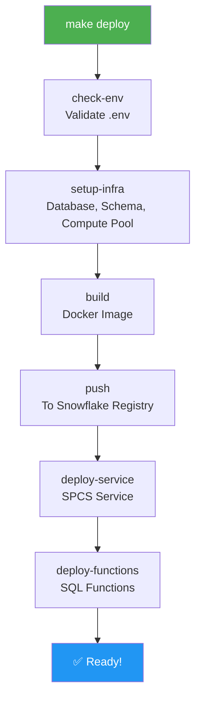

# Sales AI Platform

LangGraph workflows as FastAPI endpoints, deployable to Snowflake SPCS.

## Quick Start

```bash
# Local development
uv sync && make dev
# → http://localhost:8000/docs

# Deploy to Snowflake
cp .env.example .env  # Fill in your values
make deploy           # One command does everything (use PAT in the connection TOML to avoid MFA issues)
```

## Deployment Flow



## Project Structure

```
sales-ai-platform/
├── app.py                    # FastAPI + API schemas
├── graphs/                   # LangGraph workflows
├── release/                  # Snowflake deployment
└── Makefile                  # All commands
```
## Commands

Run `make help` to see all available commands.

**Development:**
- `make dev` - Start with auto-reload
- `make studio` - Open LangGraph Studio

**Deploy to Snowflake:**
- `make deploy` - Full deployment (one command)
- `make check-env` - Validate configuration
- `make build` - Build Docker image
- `make service-status` - Check if running

## Snowflake Setup

### 1. Create Connection
```bash
snow connection add
# Enter: account, user, role, etc.
```

### 2. Configure Environment
```bash
cp .env.example .env
nano .env
```

Required variables:
```bash
SNOW_CONNECTION=myconnection  # From ~/.snowflake/connections.toml
DATABASE=SALES_AI
SCHEMA=PLATFORM
SERVICE_NAME=sales_ai_service
# ... see .env.example for all
```

### 3. Deploy
```bash
make deploy
# Creates all resources
# Deploys service & functions
```

## Adding Workflows

**1. Create graph** (`graphs/my_workflow.py`):
```python
from pydantic import BaseModel, Field
from langgraph.graph import StateGraph, START, END

class MyState(BaseModel):
    input: str
    result: str = None
    class Config:
        arbitrary_types_allowed = True

def process(state: MyState) -> dict:
    return {"result": f"Processed: {state.input}"}

def create_graph():
    workflow = StateGraph(MyState)
    workflow.add_node("process", process)
    workflow.add_edge(START, "process")
    workflow.add_edge("process", END)
    return workflow.compile()

graph = create_graph()
```

**2. Add endpoint** (`app.py`):
```python
class MyRequest(BaseModel):
    input: str

class MyResponse(BaseModel):
    result: str

@app.post("/my-workflow", response_model=MyResponse)
async def my_workflow(request: MyRequest):
    result = await app.state.my_graph.ainvoke({"input": request.input})
    return MyResponse(result=result["result"])
```

**3. Register** (`langgraph.json`):
```json
{
  "graphs": {
    "my_workflow": "./graphs/my_workflow.py:graph"
  }
}
```

**4. Add function** (`release/function.sql`):
```sql
CREATE OR REPLACE FUNCTION my_workflow_func(input VARCHAR)
  RETURNS VARIANT
  SERVICE=sales_ai_service
  ENDPOINT=api
  AS '/my-workflow';
```

Done! Now: `make dev` → test → `make deploy`
## Troubleshooting

**Environment issues:**
```bash
make check-env  # Shows what's missing
```

**Service not starting:**
```bash
make service-logs  # View container logs
make service-drop  # Remove and redeploy
make deploy
```

**Connection errors:**
```bash
snow connection list  # See available connections
snow connection test --connection myconnection
```

---

**Need help?** Run `make help` for all commands.
